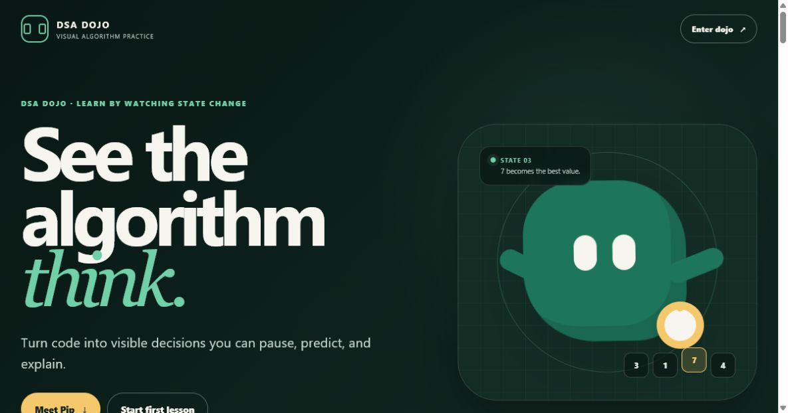
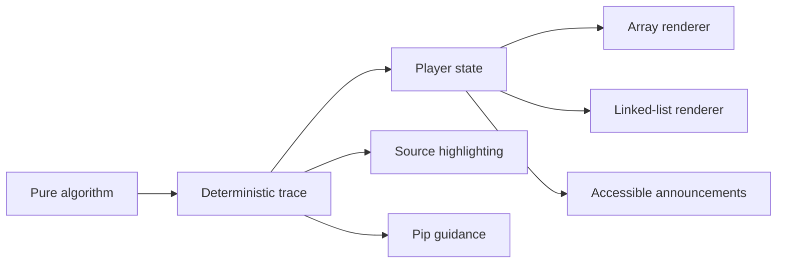

# DSA Dojo

**See the algorithm think.**

[](https://github.com/everdein/dsa-dojo/actions/workflows/ci.yml)

[Open the live DSA Dojo](https://everdein.github.io/dsa-dojo/)



DSA Dojo is a framework-free learning product that makes data structures and
algorithms visible, inspectable, and explainable with JavaScript. Learners can
move through an execution one decision at a time, connect each state change to
the code that caused it, and use Pip, an original guide companion, to reinforce
the underlying pattern.

**Current status:** A working introductory experience and seven interactive
lessons spanning arrays and linked lists.

## Try It Locally

DSA Dojo requires Node.js 22 or newer.

```bash
npm install
npm run studio
```

Open:

- `http://127.0.0.1:4173/` for the animated introduction
- `http://127.0.0.1:4173/studio` for the lesson catalog and player

If port `4173` is already in use, choose another port:

```bash
node studio/server.mjs 4180
```

Run all automated checks with:

```bash
npx playwright install chromium
npm run check:release
```

The Playwright install is a one-time setup on a new machine. `npm test` runs
the fast Node.js unit and integration suite. The release check also builds the
static site and runs Playwright browser and accessibility tests.

## 60-Second Demo Path

1. Start with **Find Largest** and predict when the best value will change.
2. Apply `-4, 8, 8, 3`, step forward twice, then rewind one decision.
3. Open **Detect a Cycle** to see the same player drive a connected-node renderer.
4. Finish either lesson to reveal replay, sample, and next-lesson actions.

## Interactive Lessons

| Category | Lesson | Core idea |
| --- | --- | --- |
| Arrays | Find Largest | Track scalar state during a linear scan |
| Arrays | Sliding Window | Reuse a fixed-size range and running aggregate |
| Arrays | Reverse Array | Swap mirrored values with converging pointers |
| Arrays | Move Zeros | Compact values with coordinated read and write pointers |
| Linked lists | Traverse a Linked List | Follow references until null |
| Linked lists | Reverse a Linked List | Protect, redirect, and advance pointers |
| Linked lists | Detect a Cycle | Use Floyd's fast-and-slow pointer technique |

Each lesson supports editable input, Previous, Next, Play/Pause, Reset, playback
speed, source highlighting, plain-language explanations, and time and space
complexity.

## How It Works

Every lesson uses the same product model:

1. A pure algorithm computes the answer.
2. A trace builder records a deterministic execution history.
3. A framework-free player controls stepping, playback, speed, and reset.
4. A renderer projects each trace step into an accessible visual state.
5. Lesson content keeps the code, narration, complexity, and Pip guidance in
   sync.

This separation makes execution reversible without mixing animation concerns
into the algorithm itself. The current array and linked-list renderers share
the same lesson contract, player, navigation, and accessibility model.



## Tech Stack

| Layer | Technology |
| --- | --- |
| Interface | Semantic HTML, modern CSS, and browser-native JavaScript |
| Modules | Native ES modules |
| Runtime | Node.js 22+ |
| Local server | Small Node.js static-file server |
| Testing | Node.js test runner, Playwright, and axe-core |
| Architecture | Pure algorithms, deterministic traces, validated lesson registry, and renderer-specific view models |
| Dependencies | No frontend framework or runtime packages |

The intentionally small stack keeps the learning code visible and lets the
project prove its interaction model before adopting additional infrastructure.

## Repository Guide

- Topic folders contain field guides and runnable JavaScript exercises.
- Files containing `Write your solution here` are intentional starter prompts;
  the `.mjs` modules used by the studio are complete, reusable implementations.
- `studio/` contains the introduction, lesson application, shared player,
  renderers, lesson definitions, and Pip.
- `test/` verifies algorithms, trace contracts, rendering state, navigation,
  input rules, player transitions, and the local HTTP boundary.
- `e2e/` verifies real desktop and mobile flows, accessibility, deep links,
  custom input, keyboard controls, and document overflow.
- [`docs/product-vision.md`](docs/product-vision.md) explains the learning
  model, experience principles, and roadmap.
- [`docs/studio-architecture.md`](docs/studio-architecture.md) documents the
  implementation, lesson contract, verification standard, and extension
  workflow.

## Broader Curriculum

The curriculum map and field guides cover arrays, strings, matrices, hash maps and sets,
linked lists, stacks, queues, heaps, trees, tries, graphs, searching, sorting,
recursion, backtracking, greedy algorithms, dynamic programming, bit
manipulation, and common problem-solving patterns.

Interactive lessons are added when a topic contributes a meaningful learning
pattern or reusable visualization capability—not simply to increase the lesson
count.

## Production Build

```bash
npm run build
npm run preview
```

`npm run build` creates a dependency-free static release in `dist/`. Its asset
and lesson links are relative, so the site works at either a domain root or a
project subpath. `npm run preview` rebuilds and serves that release locally;
the Playwright suite exercises it at the same `/dsa-dojo/` subpath used by
GitHub Pages.

Pushes to `main` deploy the verified `dist/` artifact through
`.github/workflows/pages.yml` to the live URL above.
