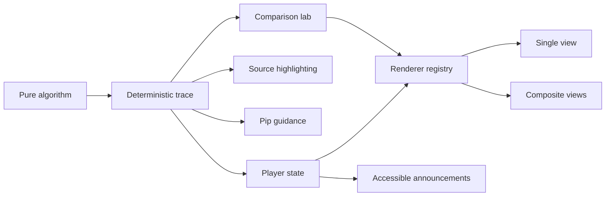

# DSA Dojo

**See the algorithm think.**

[](https://github.com/everdein/dsa-dojo/actions/workflows/ci.yml)

[Open the live DSA Dojo](https://everdein.github.io/dsa-dojo/)


DSA Dojo is a framework-free learning product that makes data structures and
algorithms visible, inspectable, and explainable with JavaScript. Learners can
move through an execution one decision at a time, connect each state change to
the code that caused it, and use Pip, an emotionally responsive original guide
companion, to reinforce predictions, discoveries, and reusable patterns.
Lesson completion, custom input, and the last visible step are saved locally so
learners can continue where they stopped without creating an account.
Both catalogs can be searched and narrowed by topic, reusable pattern, and
local progress; active filters are reflected in the URL for reloadable views.
Challenge Mode turns any lesson into an active recall round: predict each next
state, reveal the real transition, build a streak, and keep a device-local
personal best.
Algorithm Comparison Mode runs compatible lessons on shared input with
synchronized or independent stepping, projected visual state, active source
lines, complexity labels, and matching-result verification.

**Current status:** The complete core curriculum is implemented: 55 interactive
lessons across 20 topics. The next phase strengthens coverage, browser
verification, and release-pipeline gating rather than adding another core
lecture.

## Try It Locally

DSA Dojo requires Node.js 22 or newer.

```bash
npm install
npm run studio
```

Open:

- `http://127.0.0.1:4173/` for the animated introduction
- `http://127.0.0.1:4173/studio` for the lesson catalog and player

If port `4173` is already in use, choose another port:

```bash
node studio/server.mjs 4180
```

Run all automated checks with:

```bash
npx playwright install chromium
npm run check:release
```

The Playwright install is a one-time setup on a new machine. `npm test` runs
hundreds of focused Node.js unit and integration tests. The release check also
builds the static site and runs Playwright browser and accessibility tests.

## 60-Second Demo Path

1. Start with **Find Largest** and predict when the best value will change.
2. Apply `-4, 8, 8, 3`, step forward twice, then rewind one decision.
3. Open **Detect a Cycle** to see the same player drive a connected-node renderer.
4. Finish either lesson to reveal replay, sample, and next-lesson actions.

## Interactive Curriculum

The 55-lesson sequence moves from linear state to composed structures and
optimization techniques. The catalog and counts are derived from
[`studio/src/curriculum-manifest.mjs`](studio/src/curriculum-manifest.mjs).

| Topics | Lessons | Lecture range |
| --- | ---: | --- |
| Arrays | 7 | L01-L04, L09-L10, L15 |
| Linked Lists, Strings, Matrices, Hash Maps and Sets | 9 | L05-L08, L11-L14, L16 |
| Stacks, Queues, and Patterns | 7 | L17-L23 |
| Searching, Trees, and Tries | 6 | L24-L29 |
| Heaps and Priority Queues | 4 | L30-L33 |
| Graphs and Disjoint Sets | 6 | L34-L39 |
| Sorting, Recursion, and Backtracking | 8 | L40-L47 |
| Greedy, Dynamic Programming, and Bit Manipulation | 8 | L48-L55 |

See the [curriculum roadmap](docs/curriculum-roadmap.md) for every lecture,
prerequisite, reasoning pattern, and module path.

Each lesson supports editable input, Previous, Next, Play/Pause, Reset, playback
speed, source highlighting, plain-language explanations, time and space
complexity, an optional scored Challenge Mode, and side-by-side comparison for
the sorting and Fibonacci strategy families.

## How It Works

Every lesson uses the same product model:

1. A pure algorithm computes the answer.
2. A trace builder records a deterministic execution history.
3. A framework-free player controls stepping, playback, speed, and reset.
4. A renderer projects each trace step into an accessible visual state.
5. Lesson content keeps the code, narration, complexity, and Pip guidance in
   sync.

This separation makes execution reversible without mixing animation concerns
into the algorithm itself. Nine renderer adapters—array, sequence, lookup,
grid, stack, queue, branching, graph, and linked list—share the same lesson
contract, player, navigation, and accessibility model. Lessons can use one
renderer or synchronize several ordered panels.



## Tech Stack

| Layer | Technology |
| --- | --- |
| Interface | Semantic HTML, modern CSS, and browser-native JavaScript |
| Modules | Native ES modules |
| Runtime | Node.js 22+ |
| Local server | Small Node.js static-file server |
| Testing | Node.js test runner, Playwright, and axe-core |
| Architecture | Pure algorithms, deterministic traces, validated lesson registry, and renderer-specific view models |
| Dependencies | No frontend framework or runtime packages |

The intentionally small stack keeps the learning code visible and lets the
project prove its interaction model before adopting additional infrastructure.

## Repository Guide

- Topic folders contain field guides and runnable JavaScript exercises.
- Files containing `Write your solution here` are intentional starter prompts;
  the `.mjs` modules used by the studio are complete, reusable implementations.
- `studio/` contains the introduction, lesson application, shared player,
  renderers, lesson definitions, Pip, and versioned local progress and challenge
  adapters.
- `test/` verifies algorithms, trace contracts, rendering state, navigation,
  input rules, player transitions, and the local HTTP boundary.
- `e2e/` verifies real desktop and mobile flows, accessibility, deep links,
  custom input, keyboard controls, and document overflow.
- [`docs/product-vision.md`](docs/product-vision.md) explains the learning
  model, experience principles, and roadmap.
- [`docs/curriculum-roadmap.md`](docs/curriculum-roadmap.md) is the ordered,
  lecture-by-lecture delivery plan for expanding the interactive studio.
- [`docs/studio-architecture.md`](docs/studio-architecture.md) documents the
  implementation, lesson contract, verification standard, and extension
  workflow.

## Broader Curriculum

The curriculum map and field guides cover arrays, strings, matrices, hash maps and sets,
linked lists, stacks, queues, heaps, trees, tries, graphs, searching, sorting,
recursion, backtracking, greedy algorithms, dynamic programming, bit
manipulation, and common problem-solving patterns.

Interactive lessons are added when a topic contributes a meaningful learning
pattern or reusable visualization capability—not simply to increase the lesson
count.

## Production Build

```bash
npm run build
npm run preview
```

`npm run build` creates a dependency-free static release in `dist/`. Its asset
and lesson links are relative, so the site works at either a domain root or a
project subpath. `npm run preview` rebuilds and serves that release locally;
the Playwright suite exercises it at the same `/dsa-dojo/` subpath used by
GitHub Pages.

Pushes to `main` run CI across Node.js 22 and 24, including unit/integration
tests, coverage collection, a static build, and a separate Playwright browser
smoke job. The Pages workflow independently runs the fast syntax, unit, and
build checks before deploying `dist/`; making browser verification a direct
deployment gate is part of the post-curriculum hardening phase.
